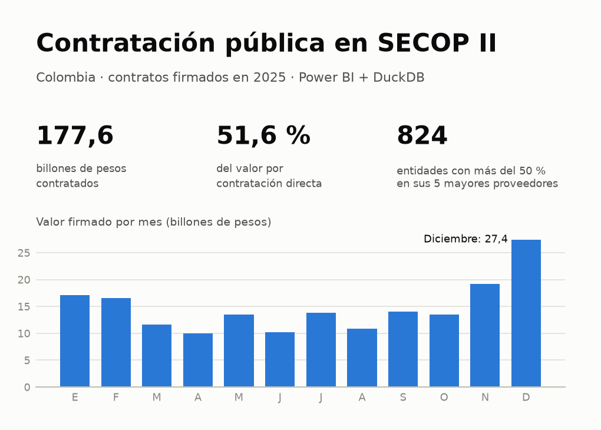
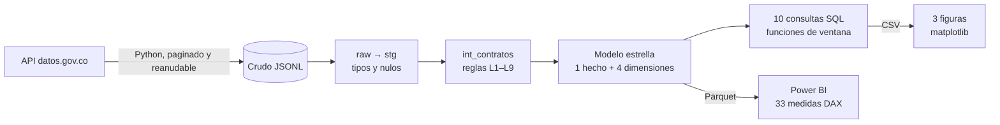
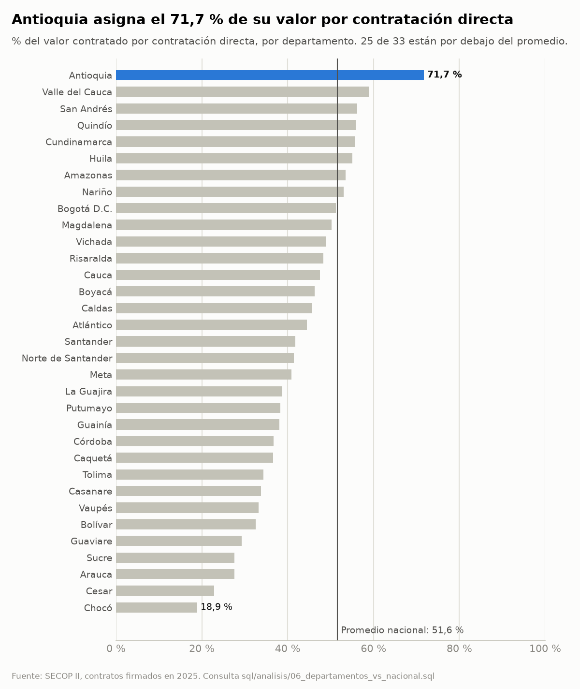
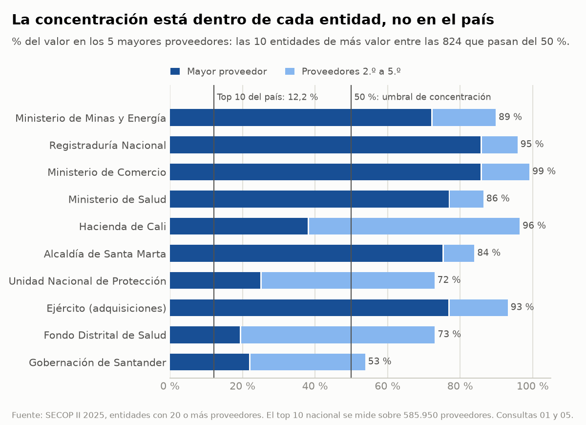
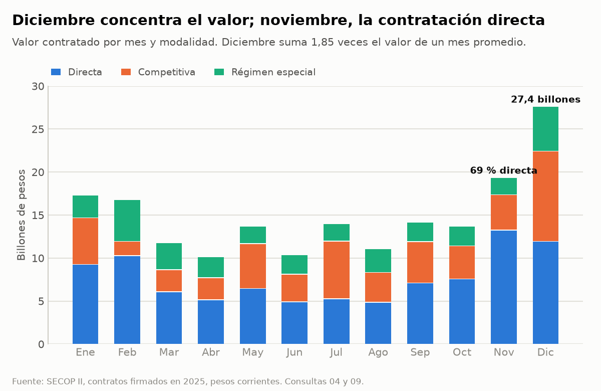

# Contratación pública en SECOP II

[](https://github.com/alexgomez-gif/secop-contratacion/actions/workflows/calidad.yml)

> ¿Cuánto contrata el Estado colombiano sin competencia y qué tan concentrado
> está ese dinero en pocos proveedores? Análisis de 1,05 millones de contratos
> firmados en 2025, con Python, DuckDB/SQL y Power BI.

**Proyecto 1 del portafolio** · [Hallazgos SQL](sql/README.md) ·
[Dashboard de Power BI](powerbi/README.md) · Dashboard interactivo y video: *próximamente*



## Resumen

- **La contratación directa es la regla, no la excepción:** se lleva el 51,6 % del valor y el 77,3 % de los contratos.
- **La concentración es local, no nacional:** los 10 mayores proveedores del país suman solo el 12,2 % del valor, pero 824 entidades entregan más de la mitad de su presupuesto a 5 proveedores.
- **El calendario pesa:** diciembre concentra 27,4 billones de pesos, y la contratación directa se acelera justo antes de la ley de garantías.

## Problema

En Colombia la regla general para escoger contratistas es la selección
competitiva (licitación pública, Ley 1150 de 2007, art. 2). La contratación
directa procede solo en causales taxativas. Cuando la vía directa domina, o
cuando una entidad reparte su presupuesto entre pocos proveedores, hay menos
competencia y menos control sobre precio y calidad.

Preguntas del proyecto:

1. ¿Qué parte del valor y de los contratos va por contratación directa, y en qué entidades y departamentos?
2. ¿Qué entidades tienen más del 50 % de su valor en sus 5 mayores proveedores?
3. ¿Hay picos de contratación a fin de año o antes de la ley de garantías?

Público: entes de control, veedurías ciudadanas y periodistas de datos que
necesitan priorizar qué revisar.

## Datos

| | |
|---|---|
| Fuente | [SECOP II - Contratos Electrónicos](https://www.datos.gov.co/d/jbjy-vk9h), Colombia Compra Eficiente |
| Acceso | API Socrata de datos.gov.co con [sodapy](https://github.com/afeld/sodapy) |
| Alcance | Contratos con fecha de firma en 2025: 1.050.953 filas descargadas el 2026-10-01; 1.050.857 contratos tras quitar duplicados |
| Valores | Pesos colombianos corrientes. Se suma `valor_analisis`, que excluye 7.024 valores imposibles o erróneos (regla L7) |

**Calidad conocida de la fuente:**

- Hay valores absurdos: hasta 944 billones de pesos en un solo contrato de 2025.
- Algunos nulos vienen escritos como texto ("No Definido").
- Cerca del 7 % de los contratos del dataset no tiene fecha de firma.
- El dataset contiene datos personales, así que el crudo no se republica y el dashboard oculta los nombres de personas naturales.

## Método



1. **Descarga** (`src/proyecto/secop.py`): consulta SoQL por año, paginada y reanudable. Un `manifest.json` compara las filas esperadas con las descargadas.
2. **Limpieza** (`sql/stg_contratos.sql`, `sql/modelo/01_int_contratos.sql`): nueve reglas, documentadas con su evidencia en [decisiones de limpieza](docs/decisiones_limpieza.md).
3. **Modelo estrella** (`sql/modelo/`): `fct_contratos` y las dimensiones entidad, proveedor, modalidad y fecha ([modelo de datos](docs/modelo_datos.md)). Trece validaciones automáticas detienen el proceso si algo no cuadra.
4. **Análisis SQL** (`sql/analisis/`): diez consultas con funciones de ventana (`RANK`, `LAG`, sumas acumuladas, barrido de eventos). Cada una documenta su pregunta, su resultado y su interpretación ([tabla de hallazgos](sql/README.md)).
5. **Figuras** (`src/proyecto/figuras.py`): una gráfica por hallazgo, generada desde los CSV de las consultas, en `docs/figuras/`.
6. **Dashboard** (`powerbi/`): proyecto PBIP con tres páginas (Resumen, Entidades y Alertas), filtros sincronizados por departamento, modalidad y mes, y medidas de inteligencia de tiempo.
7. **Calidad del código:** 47 tests con pytest y ruff en GitHub Actions en cada push.

## Hallazgos

### 1. La contratación directa domina, sobre todo en ministerios y en Antioquia

- **51,6 %** del valor contratado (91,7 billones de pesos) y **77,3 %** de los contratos fueron por contratación directa.
- **Antioquia** llega al **71,7 %** del valor, 20 puntos sobre el promedio nacional. 25 de los 33 departamentos están por debajo de ese promedio.
- **Ministerios:** varios contratan casi todo por vía directa. Minas y Energía llega al 99,3 %, Interior al 99,0 % y Salud al 97,4 %.



*Evidencia: consultas [02](sql/analisis/02_contratacion_directa_por_entidad.sql) y [06](sql/analisis/06_departamentos_vs_nacional.sql).*

### 2. La concentración de proveedores es un fenómeno por entidad

- **A escala nacional:** los 10 mayores proveedores, de 585.950, suman solo el **12,2 %** del valor.
- **Por entidad:** 824 de las 1.988 entidades con 20 o más proveedores (**41 %**) entregan más del 50 % de su valor a sus 5 mayores proveedores. En el Ministerio de Minas y Energía, un solo proveedor recibe el 72 %.



*Evidencia: consultas [01](sql/analisis/01_concentracion_top10_proveedores.sql) y [05](sql/analisis/05_entidades_concentradas_top5.sql).*

### 3. El calendario mueve el dinero: cierre de vigencia y ley de garantías

- **Diciembre** es el mes con menos contratos (50.299) y con más valor (**27,4 billones**, 1,85 veces el mes promedio).
- **Noviembre:** la contratación directa llega al **69 %** del valor del mes.
- **7 de noviembre de 2025:** se firman 5.828 contratos directos, **2,2 veces** un día hábil normal. De las 933 parejas entidad–empresa con contratos directos encadenados, 404 (43 %) firman ese día su último contrato del año. La fecha coincide con el inicio de la restricción de la ley de garantías (Ley 996 de 2005), cuatro meses antes de las elecciones legislativas de marzo de 2026.



*Evidencia: consultas [04](sql/analisis/04_picos_de_firma.sql), [07](sql/analisis/07_contratos_directos_encadenados.sql) y [09](sql/analisis/09_evolucion_mensual_por_modalidad.sql).*

Estos son patrones para priorizar la revisión, no pruebas de irregularidad.
Las diez consultas, incluidas pymes (22,6 % del valor con empresas) y
contratos simultáneos de personas naturales, están en la
[tabla de hallazgos](sql/README.md).

## Recomendación

**Priorizar el control por entidad y por fecha, no por volumen de contratos.**
Un ente de control o una veeduría puede concentrar su revisión con las alertas
del dashboard:

1. **Cruzar alta directa con alta concentración.** Revisar primero las entidades que están en los dos grupos: más del 90 % del valor por directa y más del 50 % del valor en 5 proveedores. Solo 95 entidades cumplen ambas condiciones, frente a 708 con más del 90 % directa y 824 concentradas.
2. **Vigilar las ventanas de calendario.** Las semanas previas a la ley de garantías y el cierre de vigencia (noviembre–diciembre) concentran el valor y los picos de contratación directa. El índice mensual del dashboard permite detectarlos en cualquier año.
3. **Revisar el fraccionamiento.** Las 933 parejas con 3 o más contratos directos encadenados a menos de 30 días son candidatas a revisar por posible fraccionamiento, empezando por las que no son convenios entre entidades públicas.

Para Colombia Compra Eficiente: validar el campo de valor al publicar. Un
contrato de 944 billones distorsiona cualquier suma que no lo filtre.

## Dashboard

Tres páginas en Power BI: **Resumen**, **Entidades** y **Alertas**. Detalle de
páginas, medidas y cifras de comprobación en [`powerbi/README.md`](powerbi/README.md).

<!-- Capturas: añadir cuando estén en docs/capturas/ (ver docs/publicacion/novypro.md)


-->

*Capturas del dashboard, enlace interactivo en NovyPro y video: próximamente.*

## Cómo reproducirlo

Requiere Python 3.12. Power BI Desktop (Windows) solo para el dashboard.

```bash
python3.12 -m venv .venv && source .venv/bin/activate
pip install -r requirements.txt && pip install -e .
cp .env.example .env              # opcional: token de datos.gov.co (más rápido)

python -m proyecto.secop --anio 2025   # descarga + carga en DuckDB (~16 min, 447 MB)
python -m proyecto.modelo              # limpieza + modelo + validaciones + Parquet (~15 s)
python -m proyecto.analisis            # 10 consultas -> reports/consultas/*.csv
python -m proyecto.figuras             # 3 figuras de hallazgos -> docs/figuras/*.png
pytest                                 # 47 tests
```

La descarga es reanudable: si se interrumpe, vuelve a ejecutar el mismo
comando. Para el dashboard, abre `powerbi/SECOP.pbip` y apunta el parámetro
`RutaDatos` a `data/processed/` ([instrucciones](powerbi/README.md#cómo-abrirlo)).

## Estructura

```text
├── src/proyecto/      descarga (secop.py), modelo (modelo.py), consultas (analisis.py), figuras (figuras.py)
├── sql/               staging, modelo estrella y análisis (sql/README.md)
├── powerbi/           dashboard PBIP: modelo TMDL + informe PBIR
├── docs/              modelo de datos, decisiones de limpieza, figuras y publicación
├── reports/consultas/ resultados de las consultas en CSV
└── tests/             pytest: reglas de limpieza, modelo y figuras
```

## Limitaciones

- **Un solo año (2025), en pesos corrientes:** todavía no hay comparación interanual.
- **Dimensión del departamento:** es el de la entidad contratante, no el lugar de ejecución. Bogotá incluye a las entidades nacionales.
- **Alertas como patrones:** señalan casos a revisar. Para afirmar una irregularidad hay que leer el objeto y los soportes de cada contrato.
- **Modificaciones pendientes:** las adiciones de valor (consulta 03) esperan a que termine la descarga de modificaciones.

## Autoría

Alex Gómez — [GitHub](https://github.com/alexgomez-gif)
