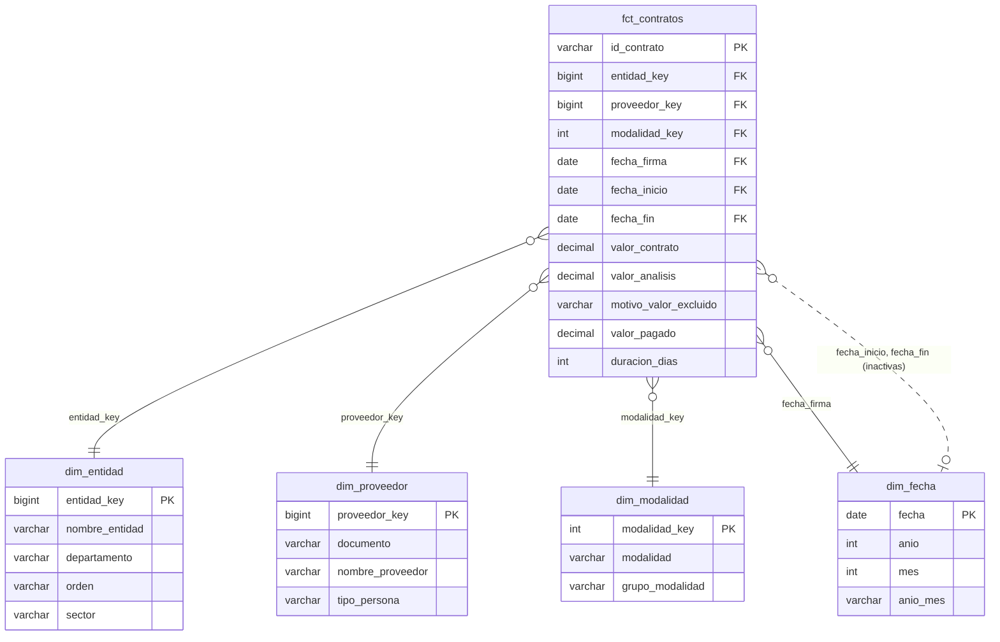

# Modelo de datos

Modelo estrella con una tabla de hechos de contratos y cuatro dimensiones.
Se construye con `python -m proyecto.modelo` a partir de `stg_contratos` y
se exporta a `data/processed/*.parquet` para Power BI.

## Capas

| Capa | Tabla | Grano | Filas (2025) | Archivo |
|---|---|---|---|---|
| Crudo | `raw_contratos` | fila de la API | 1.050.953 | `src/proyecto/secop.py` |
| Staging | `stg_contratos` | fila de la API | 1.050.953 | `sql/stg_contratos.sql` |
| Intermedia | `int_contratos` | contrato | 1.050.857 | `sql/modelo/01_int_contratos.sql` |
| Dimensión | `dim_entidad` | entidad | 4.067 | `sql/modelo/02_dim_entidad.sql` |
| Dimensión | `dim_proveedor` | documento | 588.305 | `sql/modelo/03_dim_proveedor.sql` |
| Dimensión | `dim_modalidad` | modalidad | 15 | `sql/modelo/04_dim_modalidad.sql` |
| Dimensión | `dim_fecha` | día | 15.341 | `sql/modelo/05_dim_fecha.sql` |
| Hechos | `fct_contratos` | contrato | 1.050.857 | `sql/modelo/06_fct_contratos.sql` |

Las reglas de limpieza (L1–L9) están en
[decisiones_limpieza.md](decisiones_limpieza.md).

## Decisiones de diseño

- **Grano de los hechos: un contrato.** Las preguntas del proyecto son
  sobre contratos firmados (número y valor), no sobre pagos ni
  modificaciones.
- **Claves.** Entidad: `codigo_entidad` de SECOP (estable y único).
  Proveedor: clave sustituta sobre el documento normalizado. Modalidad:
  clave sustituta. Fecha: la propia fecha (Power BI la usa como tabla de
  fechas).
- **Miembros "desconocido".** `proveedor_key = -1` (sin documento válido) y
  `modalidad_key = -1`. Así ningún contrato se pierde al relacionar tablas.
- **Fecha con tres roles.** La relación activa es `fecha_firma`. Para
  analizar por inicio o fin se activan las relaciones inactivas con
  `USERELATIONSHIP` en DAX.
- **Dimensiones degeneradas.** Tipo de contrato, estado, origen de recursos
  y objeto quedan en los hechos: tienen pocos valores o uno distinto por
  contrato y no tienen atributos propios.
- **Dos columnas de valor.** `valor_contrato` es el dato original;
  `valor_analisis` es el que se suma en las medidas (nulo en los 7.024
  contratos excluidos por L7).

## Diccionario

### fct_contratos

| Columna | Tipo | Descripción |
|---|---|---|
| `id_contrato` | texto | Identificador SECOP del contrato (clave) |
| `socrata_id` | texto | `:id` de la fila en datos.gov.co |
| `proceso_de_compra`, `referencia_del_contrato` | texto | Proceso y referencia en SECOP |
| `entidad_key` | entero | → `dim_entidad` |
| `proveedor_key` | entero | → `dim_proveedor` (-1 sin identificar) |
| `modalidad_key` | entero | → `dim_modalidad` (-1 sin información) |
| `fecha_firma` | fecha | → `dim_fecha` (relación activa) |
| `fecha_inicio`, `fecha_fin` | fecha | → `dim_fecha` (relaciones inactivas); nulas si L8 |
| `tipo_de_contrato` | texto | Prestación de servicios, Obra, Suministros… |
| `estado_contrato` | texto | En ejecución, Cerrado, Terminado… (L5) |
| `justificacion_modalidad` | texto | Causal de la modalidad |
| `codigo_categoria_unspsc` | texto | Categoría principal UNSPSC |
| `origen_recursos` | texto | Distribuido / Recursos propios |
| `proveedor_es_pyme` | booleano | El proveedor se declaró pyme en ese contrato |
| `objeto_del_contrato` | texto | Descripción libre |
| `url_proceso` | texto | Enlace al proceso en SECOP II |
| `valor_contrato` | decimal (COP) | Valor original |
| `valor_analisis` | decimal (COP) | Valor para métricas; nulo si L7 |
| `motivo_valor_excluido` | texto | Por qué `valor_analisis` es nulo |
| `valor_pagado`, `valor_facturado`, `valor_pendiente_ejecucion` | decimal (COP) | Ejecución financiera |
| `recursos_pgn`, `recursos_sgp`, `recursos_regalias`, `recursos_propios` | decimal (COP) | Fuente de financiación |
| `dias_adicionados` | entero | Prórrogas |
| `duracion_dias` | entero | `fecha_fin - fecha_inicio`; nula si fechas incoherentes |
| `fechas_inconsistentes` | booleano | Fin antes del inicio (L8) |
| `fecha_fuera_de_rango` | booleano | Alguna fecha fuera de 2000–2060 (L8) |

### dim_entidad

| Columna | Descripción |
|---|---|
| `entidad_key` | `codigo_entidad` de SECOP |
| `nombre_entidad`, `nit_entidad` | Del contrato más reciente (L9) |
| `departamento`, `ciudad` | "Sin información" si ningún contrato los trae |
| `orden` | Nacional, Territorial, Corporación Autónoma |
| `rama` | Ejecutivo, Legislativo, Judicial, Corporación Autónoma |
| `sector` | Sector administrativo (L5) |
| `entidad_centralizada` | `true` si es centralizada, `false` si es descentralizada |
| `nombres_distintos` | Cuántos nombres tuvo en los datos |

### dim_proveedor

| Columna | Descripción |
|---|---|
| `proveedor_key` | Clave sustituta; -1 = sin identificar |
| `documento` | Documento normalizado (L2) |
| `nombre_proveedor` | Nombre más frecuente (L3) |
| `tipo_documento` | NIT, Cédula de Ciudadanía… |
| `tipo_persona` | Natural, Jurídica, Sin clasificar (L6) |
| `nombres_distintos` | Cuántos nombres tuvo en los datos |

### dim_modalidad

| Columna | Descripción |
|---|---|
| `modalidad_key` | Clave sustituta; -1 = sin información |
| `modalidad` | Nombre en SECOP |
| `grupo_modalidad` | Directa, Régimen especial, Competitiva, Enajenación |
| `con_ofertas` | Modalidad directa o especial en la que se recibieron ofertas |

### dim_fecha

| Columna | Descripción |
|---|---|
| `fecha` | Día (clave) |
| `anio`, `trimestre`, `mes`, `dia` | Partes de la fecha |
| `nombre_mes`, `anio_mes` | "Enero", "2025-01" |
| `dia_semana`, `nombre_dia`, `es_fin_de_semana` | 1 = lunes … 7 = domingo |
| `semana_iso` | Semana ISO del año |

## Validaciones automáticas

`python -m proyecto.modelo` se detiene si falla alguna de estas 13
comprobaciones: unicidad de `id_contrato` y de cada clave de dimensión,
un contrato por `id_contrato` de staging, integridad referencial de las
cinco relaciones (entidad, proveedor, modalidad, fecha de firma, fechas de
inicio y fin), `entidad_key` sin nulos y coherencia entre
`valor_analisis` y `motivo_valor_excluido`.
